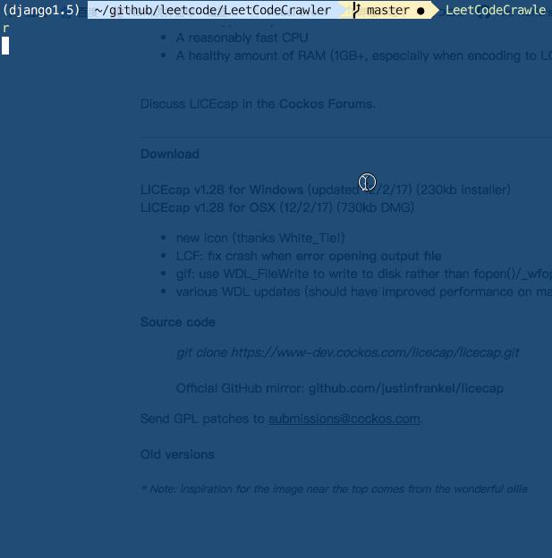

# LeetCode execrise and some small tools

there should be some descriptions.

## environment
* python2
* python3

## Install
```shell
pip install LeetCodeCrawler
```


## How to Use
```shell
LeetCodeCrawler -h

LeetCodeCrawler -l python
```


## TODO
- [ ] crawl answer
- [ ] use docopt instead of argparse
- [ ] character issue
- [ ] crawl other data
- [ ] beautify  ui
